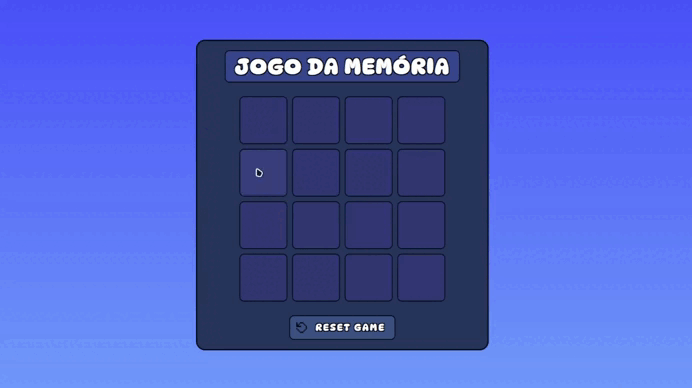

<h1 align="center"> Desafio da DIO - Jogo da Memória </h1>

 

  

## 🚀 Tecnologias

Esse projeto foi desenvolvido com as seguintes tecnologias:

- HTML, CSS e JavaScript
- Git e Github

## 💻 Projeto

Um jogo da Memória com o tema de slimes do terraria!

- [Para ver no site](https://lupyeah.github.io/Terraria-jogo-da-memoria/)

## 📋 Funcionalidades

- 📌 Jogo com cartões personalizados!
- ❗ Efeitos sonoros ao interagir com as cartas!
- 🎶 Música de fundo suave!
- 🏆 Efeito de vitória com animações!
---
